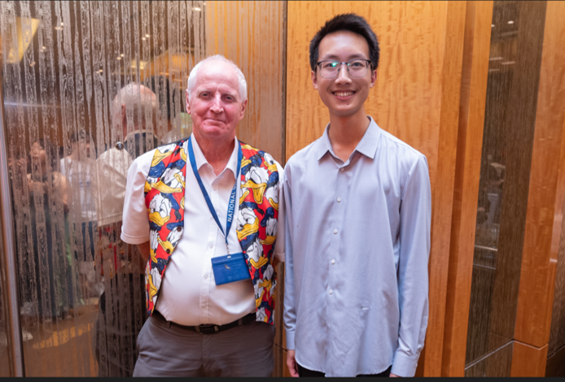

Details coming soon!

 <!--

## School of Computing Summer Workshop, National University of Singapore

I had the privilege of being advised by Professor Hugh Anderson and collaborating with students from various universities from May to July. During this period, we focused on addressing the BREACK network attack and explored methods to prevent it.   

Our group work culminated in the production of a programe paper and a poster, which can be found here: [paper](../assets/IABAS-2023-7-24-Group7.pdf)/[poster](../assets/SWS3011_07 _Poster.pdf).

## Summer Camps

* 2024.07.20-2024.07-24  School of Mathematics and Statistics, Xi'an Jiaotong University. (Excellent Camper)

--> 

<!--...
{: width="400px" }  

Photo with guidence Prof. Anderson, in NUS summer workshop

--> 

