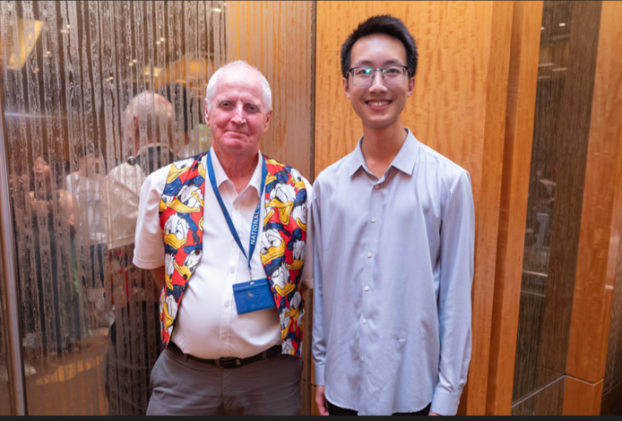

    

        Beyond my research, I often spend my free time practicing 
        Chinese calligraphy 📜. 
        I am particularly fond of the works of 文徵明 (Wen Zhengming) 
        and 董其昌 (Dong Qichang).
    

    

        In addition, I have long held a deep passion for reading, with wide-ranging interests spanning literature, 
        history, and especially philosophy. This includes both traditional Chinese philosophy, such as the 
        四书 (Four Books) and 
        五经 (Five Classics), as well as Western philosophy. 
        I once spent some time learning a bit of Latin, though only at a very beginner level.
    

    

        Recently, I’ve become especially passionate about studying the 
        易经 (I Ching) and immersing myself in Chinese history — 
        particularly the Song Dynasty and the Southern Ming period. I have long admired the life and writings of 
        文天祥 (Wen Tianxiang) — his life and spirit have long stirred my soul, awakening in me a deep passion for Love, Wisdom, Transcendence, and a faith in "天", the One beyond the self.
    

    

        I would be truly thrilled to connect with anyone who shares these interests!
    

    

        Lastly, I enjoy writing something, like essays and poems in my spare time. 
        I’ve gathered a small selection of these pieces, which I’m happy to share below ~ 
        👉 <a href="https://drive.google.com/drive/folders/1iGcyKl5uJwAhn9umMcvQY0Gch25MbL3Z?usp=sharing" 
        target="_blank" style="font-weight: bold; text-decoration: none; color: #3366cc;">
        Some of my Writings
        </a>
    

<!--...

## School of Computing Summer Workshop, National University of Singapore

I had the privilege of being advised by Professor Hugh Anderson and collaborating with students from various universities from May to July. During this period, we focused on addressing the BREACK network attack and explored methods to prevent it.   

Our group work culminated in the production of a programe paper and a poster, which can be found here: [paper](../assets/IABAS-2023-7-24-Group7.pdf)/[poster](../assets/SWS3011_07 _Poster.pdf).

## Summer Camps

* 2024.07.20-2024.07-24  School of Mathematics and Statistics, Xi'an Jiaotong University. (Excellent Camper)

--> 

<!--...
{: width="400px" }  

Photo with guidence Prof. Anderson, in NUS summer workshop

--> 

