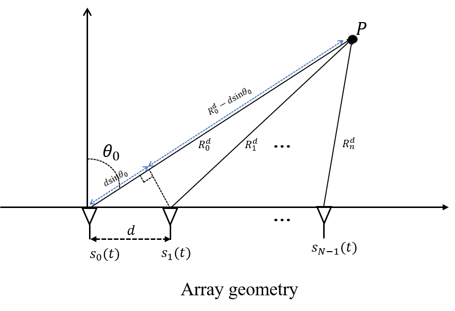
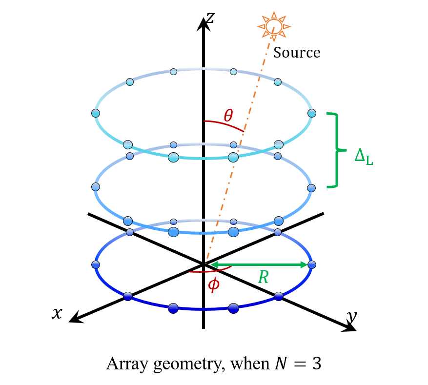

# Overview

In July 2022, I was fortunately joining Professor Y.I. Wu's research team, led the 2022-2023 university-level innovation project "Binaural Sound Source Localization Research," which was rated "Good"(Top 25%).

Since November 2022, under the joint supervision of Professor Y.I. Wu and Prof. Kainam Wong, I have primarily participated in and completed the following research projects:

**Range-Direction Beamforming for Wireless Power Transfer**

**Cylindrical Array Design to Optimize Polar-Azimuthal Direction-Finding Resolution**

**How an Acoustic Velocity-Sensor’s Direction-Finding Precision is Affected by Angular Spreading of the Incident Source**

# 1. Range-Direction Beamforming for Wireless Power Transfer Project

We focus on one specific attenna, Frequency diverse array (FDA), which:
* Synthesis of a beam pattern that has resolution over range and direction.
* With frequency offset at each antenna of the array.

Assume $N$ attennas employed,

- The signal of the $n$-th antenna: $s_n(t) = b_n^* e^{j2\pi f_n t} w(0, T)$

- The frequency of the $n$-th antenna: $f_n := f_c + \Delta_{f_n}^{(f)}, \quad \forall n = 0, 1, \ldots, N-1$

where $b_n$ and $\Delta_{f_n}^{(f)}$ are the $n$-th attenna's weight and frequecy-offset, which are not prior known$.

Our objective is to optimize the attennas' weight and frequency offset for wireless power transfer to a specific position. This optimization is particularly beneficial for near-field wireless transfer applications, such as smartphone charging.

My work includes the following points:

* To design the power-on window $\mathcal{T}_{\text{all}}$, which ensures that all signals arrive at the designated position during this time period.
* To thoroughly design the optimization problem expression.
* To simultaneously optimize $b_n$ and $\Delta_{f_n}^{(f)}$ using Matlab solvers such as `fmincon`, `ga` (genetic algorithm), etc.

The optimization problem is expressed as follows:

  

# 2. Cylindrical Array Design to Optimize Polar-Azimuthal Direction-Finding Resolution Project

This project proposes a feasible and closed design method for cylindrical uniform sensor arrays by analyzing the trade-off between array volume and the measurement accuracy of horizontal and polar azimuth angles, in detail, we want to design paramters ${N, \Delta_{L}, R}$, to satisfy:

(A) Achieving higher_ resolution for the source signal is reflected in lower values of the Cramer-Rao Bound (CRB), including CRB for the incident polar angle 
($CRB_{\theta}$) and a ($CRB_{\phi}$).

(B) Ease of application implies occupying a smaller volume and surface area, making it more convenient for deposit.

  

