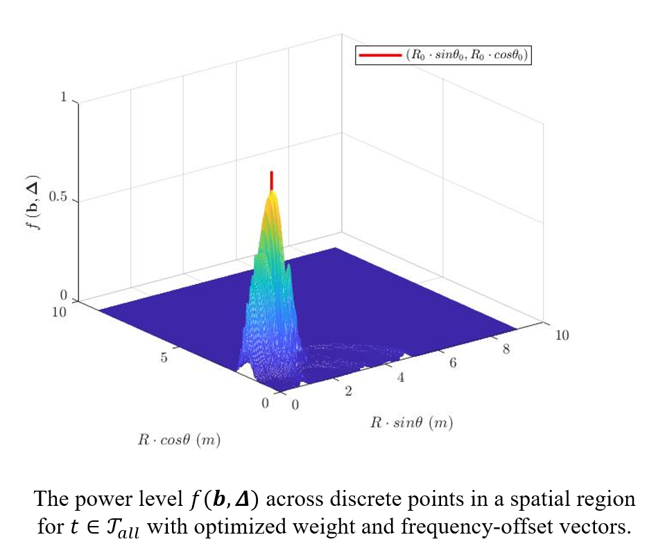

# Overview

In July 2022, I was fortunately joining Professor Y.I. Wu's research team, and led the 2022-2023 university-level innovation project "Binaural Sound Source Localization Research," which was rated "Good"(Top 25%) in the end.

Since November 2022, under the guidance of Professor Y.I. Wu and Prof. Kainam Wong, I have primarily participated in the following research projects:

* <small><strong>Range-Direction Beamforming for Wireless Power Transfer</strong></small>

* <small><strong>Cylindrical Array Design to Optimize Polar-Azimuthal Direction-Finding Resolution</strong></small>

* <small><strong>How an Acoustic Velocity-Sensor’s Direction-Finding Precision is Affected by Angular Spreading of the Incident Source</strong></small>

## 1. Range-Direction Beamforming for Wireless Power Transfer Project

We focus on one specific attenna, Frequency diverse array (FDA), which:
* Synthesis of a beam pattern that has resolution over range and direction.
* With frequency offset at each antenna of the array.

{: width="400px" }

Assume $N$ attennas employed,

- The signal of the $n$-th antenna: $s_n(t) = b_n^* e^{j2\pi f_n t} w(0, T)$

- The frequency of the $n$-th antenna: $f_n := f_c + \Delta_{f_n}^{(f)}, \quad \forall n = 0, 1, \ldots, N-1$

where $b_n$ and $\Delta_{f_n}^{(f)}$ are the $n$-th attenna's weight and frequecy-offset, which are not prior known$.

Our objective is to optimize the attennas' weight and frequency offset for wireless power transfer to a specific position. This optimization is particularly beneficial for near-field wireless transfer applications, such as smartphone charging.

My work includes the following points:

* Design the power-on window $\mathcal{T}_{\text{all}}$, which ensures that all signals arrive at the designated position during this time period.
* Design the optimization problem expression detailedly.
* Simultaneously optimize $b_n$ and $\Delta_{f_n}^{(f)}$ using Matlab solvers such as `fmincon`, `ga` (genetic algorithm), etc.

The optimization problem is expressed as follows:

$$ 
\begin{aligned}
    &\arg \min_{{\bf b}, {\bf \Delta}^{(f)}_n} |{\bf b}^H \mathbf{v}(R, \theta; t)|^2, \\
    &\text{subject to:} \\
    &\quad \left( \{ \forall (R, \theta) \notin \mathbb{S}_{\text{rx}} \} \cap \{ \forall t \in \mathcal{T}_{\text{all}} \} \right) \cup \{ \forall t \notin \mathcal{T}_{\text{all}} \}, \\
    &\quad |{\bf b}^H \mathbf{v}(R_0, \theta_0; t)|^2 = 1, \quad \forall t \in \mathcal{T}_{\text{all}}, \\
    &\quad {\bf \Delta}_{\text{lb}} \preceq {\bf \Delta} \preceq {\bf \Delta}_{\text{ub}},
\end{aligned}
$$

{: width="400px" }

## 2. Cylindrical Array Design to Optimize Polar-Azimuthal Direction-Finding Resolution Project

This project proposes a feasible and closed design method for cylindrical uniform sensor arrays by analyzing the trade-off between array volume and the measurement accuracy of horizontal and polar azimuth angles, in detail, we want to design paramters ${N, \Delta_{L}, R}$, to satisfy:

(A) Achieving higher_ resolution for the source signal is reflected in lower values of the Cramer-Rao Bound (CRB), including CRB for the incident polar and azimuthal angle, respectively.

(B) Ease of application implies occupying a smaller volume and surface area, making it more convenient for deposit.

{: width="400px" }

My work includes the following points:

* Derive the Cramer-Rao bound from the array manifold.
* Propose a closed-form design procedure.
* Create graphs, writing in LaTeX, and other related tasks.

## 3. How an Acoustic Velocity-Sensor’s Direction-Finding Precision is Affected by Angular Spreading of the Incident Source Project

This project primarily investigated the impact of incident source angle deviation on direction-finding accuracy for two or three superimposed figure-8 sensors and(or without) a pressure sensor under different placement methods. 

Two sub-projects are consisted in this project, corresponds to two different different placement methods of sensors respectively:

### a) How a Bi-Axial Velocity-Sensor's Direction-Finding Precision is Affected by Angular Spreading of the Incident Source

### b) How a Tri-Axial Velocity-Sensor's Direction-Finding Precision is Affected by Angular Spreading of the Incident Source

In the above two sub-projects, my work includes the following points:

* Deriving the Fisher Information Matrix and Cramer-Rao bound from the array manifold, with respect to the known/unknown variance of elevation and azimuth angles a priori.
* Analyzing and explaining the trend of the Cramer-Rao bound with varying variance of noise, elevation angle, etc.
* Creating graphs, writing in LaTeX, and performing other related tasks.

